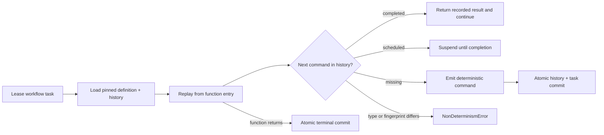

# Replay and determinism

## The replay model

Workflow workers never restore a serialized Python stack. They run the
pinned function from the beginning and resolve each SDK call from committed
history.

Activity, timer, and marker calls receive ordinal command IDs. Scheduled
events store the type, canonical argument fingerprint, and logical entity
identity. Signals and attempt events are indexed separately because they can
interleave with commands. `ctx.gather` assigns children in source order and
returns that order regardless of completion order. `ctx.now()`,
`ctx.random()`, and `ctx.uuid()` commit `MarkerRecorded` values and reuse them
on every replay — this is what lets otherwise-nondeterministic calls stay
safe to use inside workflow code.

`engine replay-check` runs this exact model without writes and reports the
first divergent command or terminal value — see the
[CLI reference](../reference/cli.md#engine-replay-check-workflow_id) and
[deploy to production](../how-to/deploy-to-production.md) for when to run it.

## Transaction and lease invariants

A workflow transition validates the workflow-task token, locks the execution
row, allocates consecutive sequence numbers from `next_seq`, appends every
new event, inserts each resulting activity/timer/workflow task, and completes
the leased task in one transaction. No event/task pair can be observed
halfway.

Activity execution occurs outside a transaction. Leasing an activity and
appending `ActivityStarted` are atomic. Completion then validates the same
live token, locks the execution, appends the terminal attempt event,
completes the attempt, and either inserts a retry or wakes replay. A stale
token matches no row, so late and duplicate workers cannot commit.

An expired workflow lease is returned to `pending` without a history event,
because no workflow fact occurred. An expired activity lease is different: it
commits `ActivityTimedOut`, closes that attempt, records the chosen jittered
retry time, and creates a new task ID and token. Heartbeats may extend the
lease and heartbeat deadline but never the start-to-close deadline.

Signals use a caller-provided unique ID. Signal ingestion, timer firing, and
workflow replay all lock the same execution row before allocating history
sequence numbers. A signal-timeout race is therefore permanently decided by
commit order; replay compares those recorded sequence numbers. A signal that
wins before the timeout is needed also records `TimerCanceled`.

## Activity delivery and idempotency

Activities are at least once. Every logical activity has a deterministic
`entity_id`; all retry tasks receive that value as
`current_activity_context().idempotency_key`. Attempts have independent task
IDs and lease tokens. The bundled effect ledger demonstrates the
cooperating-boundary pattern with a unique key, but it is test evidence
rather than a claim about arbitrary APIs — the engine does not guarantee
exactly-once arbitrary side effects. An activity can perform an external
effect and die before recording completion; exactly-once behavior exists only
when that external boundary atomically deduplicates the engine-provided
idempotency key.

Cancellation is cooperative. The API commits one
`WorkflowCancellationRequested`, prevents new activity/timer work, wakes
replay, and exposes the request through `ctx.cancellation_requested`.
Activity heartbeats raise `ActivityCancellationRequested`. Termination and
cancellation fence future completion, but neither can reverse an effect
already in progress.

## Versioning

Every execution pins `(workflow_type, definition_version)`. Definitions are
immutable in both the runtime registry and PostgreSQL; registering different
code at the same identity fails. Workers advertise their supported versions
and release unsupported tasks without changing history. Old code must remain
deployed until no open execution references it. `replay-check` detects
incompatibility but does not migrate histories.
